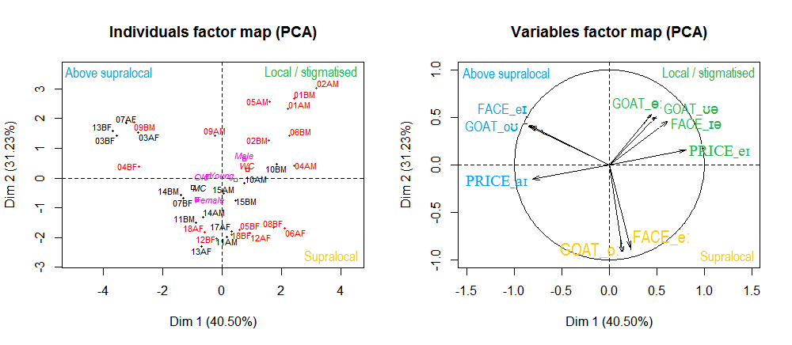

## Welcome to the PCA workshop for phonetic research.
*Hello, this is Maelle! I'm a lecturer at the University of Paris Sorbonne Nouvelle, professeure agrégée and currently doing and interdisciplinary PhD in sociophonetics & statistics.*

 **_PCA analysis performed on the percentage of FACE, GOAT and PRICE variants in the 1994 PVC corpus of Newcastle English (Amand, Ballier & Corrigan, 2018)_.**

Please download the PCAphon workshop package. We will go through the files as we proceed through the workshop.
We will be using several phonetics datasets so that you practice the interpretation of PCA results better. In the package, you will also find different publications in phonetics and linguistics that have used the statistical approach so that you may have examples of how to report your results. 

At the end of the workshop you will:
- have a general understanding of PCA.
- know the correspondence of PCA key words from one school of PCA to the next to understand results in publications.
- know how to organise your data table to use it for PCA.
- know the main functions of the R package {FactoMineR}.
- know how to interpret PCA graphs and correlation circles.
- find the relevant information in the loadings (PCA output) to answer your research questions.
- know how to perform a hierarchical cluster analysis based on PCA.

## Workshop coming soon
  - 11th & 18th June: ggplot2 & multivariate analysis (Paris Sorbonne Nouvelle University)
 
## Previous workshops I have given

- RStudio for postgraduate linguistic research (Paris Sorbonne Nouvelle University)
    - Weekly course for one semester
    - 2 day workshops
- Data analysis with the coding scheme of the PAC-project database on English varieties (Paris Diderot University)
- Mixed effects models applied to phonetic data (Paris Diderot University)
- Statistics for the humanities: learn to build statistical models for qualitative data (Paris Diderot University)
- Regular one-on-one courses in statistics with RStudio.
- Statistics in RStudio for linguistics: clinic session (Newcastle University)
